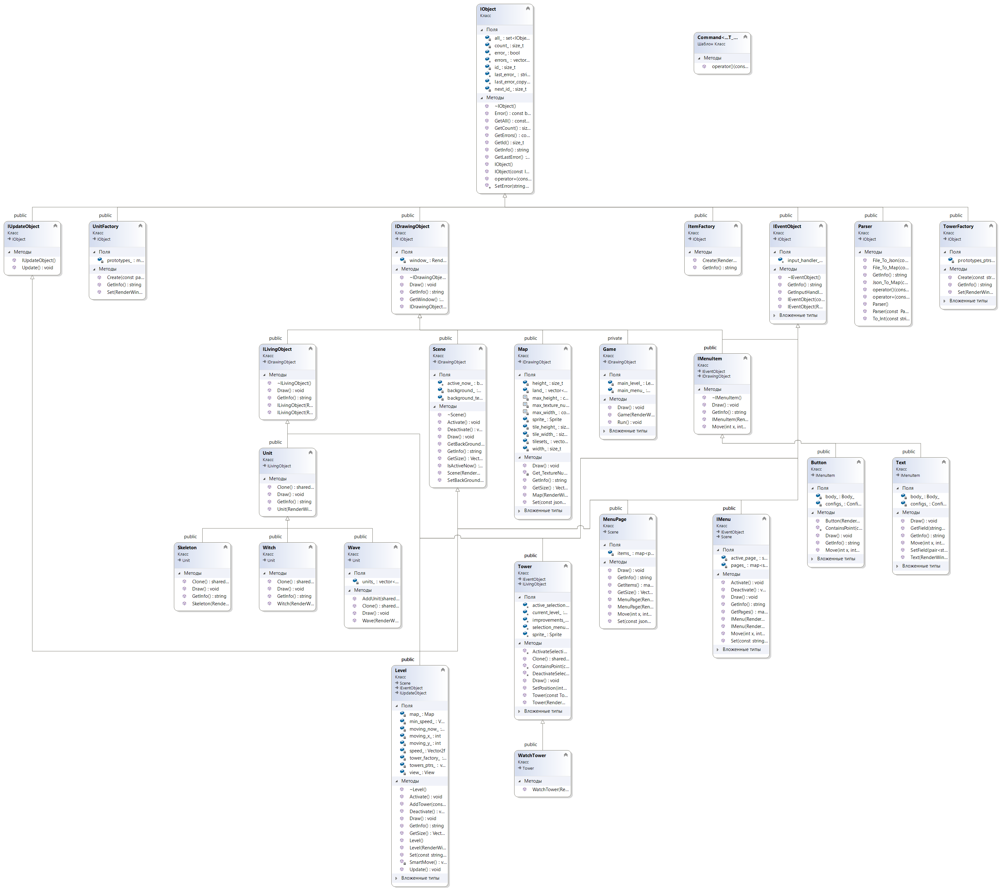

#Запуск
- Ubuntu:
  - 1. sudo apt-get install libsfml-dev
  - 2. Скачать проект и собрать через CMake.

#Описание
Классический tower defence. Есть замок, есть расположенные на карте лагеря противника. Есть дорога, соединяющая их.
За одну итерацию, называемую волной, из лагерей по очереди выходят солдаты противника, и движутся по направлению к замку.
Игрок может ставить на карту военные сооружения, атакующие вражеских воинов. Цель игры: не дать воинам добраться до замка и разрушить его.

Здесь находятся как структурные, так и поведенческие паттерны. В целом игра очень далека от своего завершения, на данный момент существует возможность лишь передвигаться по карте, используя ASDW, масштабировать ее с помощью тачпада или колесика мыши, делать щетлчки на кнопки и взаимодействовать с орудиями (на карте находятся в один ряд слева).

Структурные паттерны:

- Composite:
представлен в виде волн соперников (waves), которые могут составляться из подволн (соответственно также waves), и из юнитов. Может быть удобно, так как воины одной волны могут выходить из разных мест на карте и в разное время, поэтому разумно такие подгруппы выделить в отдельные волны, а потом объединить в общую волну.

- Flyweight:
класс Button. Пуль может быть в одно и то же время на карте довольно много, и при этом все они имеют одинаковые спрайты, размеры, и прочие характеристики. Поэтому вместо того, чтобы хранить все такие поля в каждом экземпляре класса, лучше выделить их в отдельную структуру, разделяемую всеми объектами.

Поведенческие паттерны:

- Command:
представлен в интерфейсе пользователя классом EventObject, который принимает Command для выполнения различных команд взаимодействия с клавиатурой и мышью. Так любые классы могут определять действия, совершаемые в ответ на команды пользователя.

#ClassDiagram

